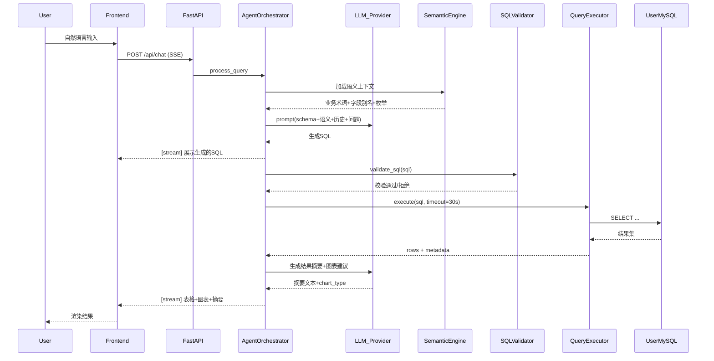

# DataAgent MVP 实现计划

## 已确认的MVP边界

- **LLM**: 多模型抽象层，支持 OpenAI / Claude / 国产模型切换
- **数据库**: MVP仅支持 MySQL（架构预留扩展点）
- **部署**: 本地开发优先，Docker Compose 支持私有化，架构兼容未来 SaaS
- **前端**: 对话式查询界面 + 数据源管理后台 + 语义层配置界面

---

## 项目结构

```
DataAgent/
├── backend/                      # Python FastAPI 后端
│   ├── app/
│   │   ├── main.py               # 应用入口 + CORS + 中间件
│   │   ├── config.py             # 配置管理(环境变量/yaml)
│   │   ├── api/                  # API路由层
│   │   │   ├── chat.py           # POST /api/chat (核心对话接口，SSE流式)
│   │   │   ├── datasource.py     # 数据源CRUD
│   │   │   ├── semantic.py       # 语义层配置CRUD
│   │   │   ├── auth.py           # 登录/注册/token
│   │   │   └── admin.py          # 用户管理/审计日志查看
│   │   ├── core/                 # 核心业务逻辑
│   │   │   ├── agent.py          # Agent编排器(意图->生成->校验->执行->结果)
│   │   │   ├── llm/
│   │   │   │   ├── base.py       # BaseLLM抽象类
│   │   │   │   ├── openai_llm.py
│   │   │   │   ├── claude_llm.py
│   │   │   │   ├── deepseek_llm.py
│   │   │   │   └── factory.py    # LLM工厂，按配置创建实例
│   │   │   ├── query/
│   │   │   │   ├── generator.py  # NL->SQL，组装prompt+schema+语义层
│   │   │   │   ├── validator.py  # SQL安全校验(禁DDL/DML, 注入检测)
│   │   │   │   └── executor.py   # 安全执行(超时/行数限制/只读连接)
│   │   │   ├── semantic/
│   │   │   │   ├── engine.py     # 语义层引擎:解析别名/术语/枚举
│   │   │   │   └── loader.py     # 从DB加载语义配置,构建prompt上下文
│   │   │   └── conversation/
│   │   │       └── manager.py    # 对话历史管理,上下文拼接
│   │   ├── connectors/
│   │   │   ├── base.py           # BaseConnector抽象类
│   │   │   ├── mysql_connector.py
│   │   │   └── schema_discovery.py  # 元数据自动发现
│   │   ├── models/               # SQLAlchemy ORM + Pydantic Schema
│   │   │   ├── database.py       # DB引擎和Session
│   │   │   ├── datasource.py     # 数据源模型
│   │   │   ├── semantic.py       # 语义层模型(术语/别名/枚举)
│   │   │   ├── user.py           # 用户+角色模型
│   │   │   ├── conversation.py   # 对话历史模型
│   │   │   └── audit.py          # 审计日志模型
│   │   └── auth/
│   │       ├── jwt_handler.py    # JWT签发/验证
│   │       └── rbac.py           # 角色权限检查
│   ├── alembic/                  # 数据库迁移
│   ├── requirements.txt
│   ├── .env.example
│   └── Dockerfile
├── frontend/                     # Next.js 前端
│   ├── src/
│   │   ├── app/
│   │   │   ├── page.tsx          # 主对话页面
│   │   │   ├── layout.tsx        # 根布局(侧边栏+顶栏)
│   │   │   ├── login/page.tsx
│   │   │   ├── admin/
│   │   │   │   ├── datasources/page.tsx   # 数据源管理
│   │   │   │   ├── semantic/page.tsx      # 语义层配置
│   │   │   │   └── users/page.tsx         # 用户管理
│   │   │   └── history/page.tsx           # 查询历史
│   │   ├── components/
│   │   │   ├── chat/
│   │   │   │   ├── ChatPanel.tsx          # 对话面板
│   │   │   │   ├── MessageBubble.tsx      # 消息气泡(含SQL/表格/图表)
│   │   │   │   ├── QueryInput.tsx         # 输入框+建议
│   │   │   │   └── SqlPreview.tsx         # SQL预览+确认
│   │   │   ├── results/
│   │   │   │   ├── DataTable.tsx          # 结果表格(排序/分页)
│   │   │   │   ├── ChartView.tsx          # 自动图表(ECharts)
│   │   │   │   └── InsightSummary.tsx     # 自然语言摘要
│   │   │   ├── admin/
│   │   │   │   ├── DatasourceForm.tsx     # 数据源配置表单
│   │   │   │   ├── SemanticEditor.tsx     # 语义层编辑器
│   │   │   │   └── SchemaViewer.tsx       # Schema浏览器
│   │   │   └── ui/                        # shadcn/ui组件
│   │   └── lib/
│   │       ├── api.ts                     # API请求封装
│   │       └── types.ts                   # TypeScript类型定义
│   ├── package.json
│   ├── tailwind.config.ts
│   └── Dockerfile
├── docker-compose.yml            # 编排: backend + frontend + postgres + redis
└── README.md
```

---

## 核心数据流



---

## 实现步骤（按依赖顺序）

### Step 1: 项目脚手架与基础设施

创建项目目录结构，初始化后端（FastAPI + SQLAlchemy + Alembic）和前端（Next.js + shadcn/ui + TailwindCSS），编写 `docker-compose.yml`（PostgreSQL 作为系统元数据库 + Redis 缓存），配置 `.env.example`。

核心配置项:

- `LLM_PROVIDER`: openai / claude / deepseek
- `LLM_API_KEY`: API密钥
- `LLM_MODEL`: 模型名称
- `SYSTEM_DB_URL`: 系统PostgreSQL连接串
- `REDIS_URL`: Redis连接串
- `JWT_SECRET`: JWT密钥

### Step 2: 数据模型与数据库迁移

定义核心ORM模型:

- **DataSource**: id, name, db_type(mysql), host, port, database, username, encrypted_password, is_active, created_at
- **TableMetadata**: id, datasource_id, table_name, table_comment, columns_json, discovered_at
- **BusinessTerm**: id, datasource_id, term_name, definition, sql_expression (如 `SUM(order_amount)`)
- **FieldAlias**: id, datasource_id, table_name, column_name, alias_name, description
- **EnumMapping**: id, datasource_id, table_name, column_name, enum_value, display_label
- **TableRelation**: id, datasource_id, source_table, source_column, target_table, target_column, relation_type
- **User**: id, username, password_hash, role(admin/analyst/viewer), is_active
- **Conversation**: id, user_id, title, created_at
- **Message**: id, conversation_id, role(user/assistant), content, sql_generated, execution_time_ms, row_count, created_at
- **AuditLog**: id, user_id, action, datasource_id, sql_executed, row_count, duration_ms, created_at

### Step 3: 多模型LLM抽象层

`BaseLLM` 抽象类定义统一接口:

```python
class BaseLLM(ABC):
    @abstractmethod
    async def chat(self, messages: list[dict], temperature: float = 0) -> str: ...

    @abstractmethod
    async def chat_stream(self, messages: list[dict], temperature: float = 0) -> AsyncGenerator[str, None]: ...
```

实现 `OpenAILLM`, `ClaudeLLM`, `DeepSeekLLM` 三个Provider，通过 `LLMFactory.create(provider_name)` 统一创建。

### Step 4: MySQL连接器与元数据发现

- `MySQLConnector`: 基于 aiomysql 的异步连接池，只读连接（`SET SESSION TRANSACTION READ ONLY`）
- `SchemaDiscovery`: 通过 `INFORMATION_SCHEMA` 自动扫描表、字段、类型、索引、注释
- 元数据存入 `TableMetadata`，支持手动触发刷新

### Step 5: 语义层引擎

`SemanticEngine` 核心职责:

1. 从DB加载当前数据源的所有语义配置（术语/别名/枚举/关联关系）
2. 构建结构化的 Schema Description 给 LLM 用作上下文
3. 格式示例:

```
数据库: ecommerce
表: orders (订单表)
  - id: INT, 主键, 订单ID
  - user_id: INT, 外键->users.id, 用户ID
  - status: INT, 订单状态 (1=待支付, 2=已支付, 3=已发货, 4=已完成, 5=已取消)
  - amount: DECIMAL, 订单金额
  - created_at: DATETIME, 下单时间

业务术语:
  - GMV: SUM(amount) WHERE status IN (2,3,4)
  - 客单价: GMV / COUNT(DISTINCT user_id) WHERE status IN (2,3,4)

表关联:
  - orders.user_id -> users.id
  - orders.product_id -> products.id
```

### Step 6: NL-to-SQL Agent 编排器

`AgentOrchestrator.process_query()` 核心流程:

1. 从 `ConversationManager` 获取最近N轮对话历史
2. 从 `SemanticEngine` 加载数据源Schema + 语义上下文
3. 组装 System Prompt（角色设定 + 规则约束 + Schema + 语义层 + Few-shot样本）
4. 调用 LLM 生成 SQL
5. `SQLValidator` 校验: 禁止DDL/DML, 检测危险操作, 强制LIMIT
6. `QueryExecutor` 安全执行: 超时30s, 最大返回10000行
7. 再次调用 LLM 生成结果摘要和图表推荐
8. 通过 SSE 流式返回各阶段结果

System Prompt 核心结构:

```
你是一个SQL专家助手。根据用户的自然语言问题，生成精确的MySQL查询。

规则:
1. 只生成SELECT语句
2. 必须添加LIMIT（默认100）
3. 使用提供的Schema信息，不要假设不存在的表或字段
4. 遵循业务术语定义中的精确计算口径
5. 输出格式: ```sql\n...\n```

{schema_context}

{semantic_context}

{few_shot_examples}

{conversation_history}
```

### Step 7: SQL安全校验器

`SQLValidator` 关键检查:
- 解析SQL AST（使用 sqlglot 库），拒绝非SELECT语句
- 检测SQL注入模式
- 强制添加LIMIT（若用户未指定）
- 检查引用的表/字段是否存在于元数据中
- 预估查询复杂度（JOIN数量、子查询深度）

### Step 8: API路由层

核心接口:
- `POST /api/auth/login` -- 登录获取JWT
- `POST /api/chat` -- 主查询接口(SSE流式返回)
- `GET /api/conversations` -- 查询历史列表
- `GET /api/conversations/{id}/messages` -- 某次对话的消息
- `CRUD /api/datasources` -- 数据源管理
- `POST /api/datasources/{id}/discover` -- 触发元数据发现
- `GET /api/datasources/{id}/schema` -- 查看Schema
- `CRUD /api/semantic/terms` -- 业务术语管理
- `CRUD /api/semantic/aliases` -- 字段别名管理
- `CRUD /api/semantic/enums` -- 枚举映射管理
- `CRUD /api/semantic/relations` -- 表关联管理
- `GET /api/admin/audit-logs` -- 审计日志
- `CRUD /api/admin/users` -- 用户管理

### Step 9: 前端对话界面

主页面为对话式交互:
- 左侧边栏: 对话历史列表 + 新建对话按钮
- 中间主区域: 消息流，每条助手消息包含:
  - 生成的SQL（可折叠查看，语法高亮）
  - 数据表格（支持排序、分页）
  - 自动图表（基于ECharts，LLM推荐图表类型）
  - 自然语言摘要
- 底部输入框: 支持回车发送，Shift+Enter换行
- 顶部: 当前选择的数据源切换

### Step 10: 管理后台界面

- **数据源管理页**: 数据源列表 + 添加/编辑/测试连接/删除 + 触发Schema发现
- **语义层配置页**: Tab切换（业务术语 / 字段别名 / 枚举映射 / 表关联），表格+表单编辑
- **Schema浏览器**: 树状展示 库->表->字段，点击字段可快速添加别名
- **用户管理页**: 用户列表、角色分配、启用/禁用
- **审计日志页**: 查询日志表格，支持按用户/时间/数据源筛选

### Step 11: 权限与审计

- JWT认证中间件，所有API需带Token
- RBAC三种角色: admin(全部权限), analyst(查询+查看), viewer(仅查询)
- 每次查询自动写入AuditLog
- 数据源级别的访问控制（配置某角色可访问哪些数据源）

### Step 12: Docker化与文档

- 后端 Dockerfile (Python 3.11 + uvicorn)
- 前端 Dockerfile (Node 20 + next build + standalone)
- docker-compose.yml 编排所有服务
- README.md: 快速开始指南、配置说明、架构说明

---

## 关键技术依赖

**后端 (Python)**:
- fastapi, uvicorn -- Web框架
- sqlalchemy, alembic -- ORM与迁移
- aiomysql -- MySQL异步驱动
- asyncpg -- PostgreSQL异步驱动（系统DB）
- openai, anthropic -- LLM SDK
- sqlglot -- SQL解析与校验
- pyjwt -- JWT认证
- redis, aioredis -- 缓存
- python-dotenv -- 环境变量
- cryptography -- 密码加密

**前端 (TypeScript)**:
- next 14+ (App Router)
- react 18+
- tailwindcss
- shadcn/ui
- echarts / echarts-for-react -- 图表
- react-syntax-highlighter -- SQL语法高亮
- zustand -- 状态管理

---

## MVP之后的迭代路线（不在本次范围）

- P1: 增加 PostgreSQL、ClickHouse 连接器
- P1: 跨库联合查询
- P2: 行级/列级权限控制
- P2: 内置分析模板（留存/漏斗/RFM）
- P2: IM集成（飞书/钉钉机器人）
- P3: 协作功能（分享/评论/看板）
- P3: Few-shot样本自动优化Pipeline

> 本文档由 Cursor 计划 `dataagent_mvp实现计划_abd70f21.plan.md` 同步至仓库 `docs/`，便于版本管理与团队共享。
