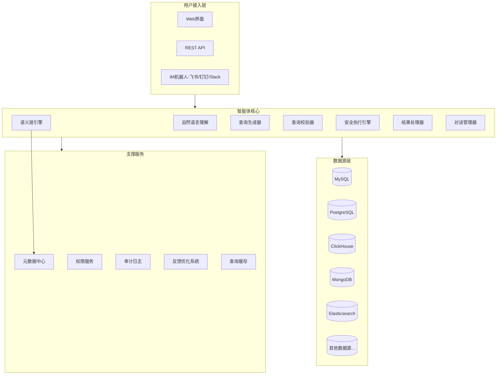

# DataAgent 数据智能体 -- 产品需求构思

## 一、产品定位与核心价值

**一句话定位**: 基于大语言模型的企业级自然语言数据查询与分析智能体，让每个人都能用"说人话"的方式获取和理解数据。

**核心要解决的问题**:

- 非技术人员（PM、运营、管理层）依赖数据团队取数，效率低、周期长
- 数据分析师大量时间消耗在重复性的"取数"工作上，无法聚焦高价值分析
- 数据散落在多种异构数据库中，跨库查询门槛极高
- SQL 学习曲线陡峭，业务人员难以掌握

**目标用户画像**:


| 角色    | 典型场景                            | 核心诉求             |
| ----- | ------------------------------- | ---------------- |
| 产品经理  | "上周新注册用户中，来自抖音渠道的次日留存率是多少？"     | 快速自助取数，验证产品假设    |
| 运营人员  | "帮我看下618活动期间各品类的GMV对比去年同期的增长情况" | 活动效果追踪，无需等待数据报表  |
| 管理层   | "本季度各业务线的利润率排名，标出低于目标的"         | 经营数据一目了然，辅助决策    |
| 数据分析师 | "写一个用户分层的RFM模型查询"               | 加速复杂分析，减少重复SQL编写 |
| 数据工程师 | "检查orders表最近7天的数据量趋势，有没有异常"     | 数据质量监控，快速排障      |


---

## 二、核心功能模块

### 模块1: 自然语言查询引擎（核心中的核心）

**1.1 意图理解与解析**

- 支持中英文自然语言输入
- 识别查询意图：简单查询、聚合统计、趋势分析、对比分析、排名、筛选等
- 支持模糊表达和口语化输入（如"上个月"自动映射为日期范围）
- 时间表达智能解析（"最近一周"、"上个季度"、"去年双11期间"）
- 业务术语自动映射（"GMV" -> 对应计算公式，"留存率" -> 对应计算逻辑）

**1.2 SQL/查询语句生成**

- 生成标准SQL并适配不同数据库方言（MySQL、PostgreSQL、ClickHouse、Presto等）
- 生成NoSQL查询（MongoDB aggregation pipeline、Elasticsearch DSL）
- 支持复杂查询能力：
  - 多表JOIN
  - 子查询与CTE
  - 窗口函数（排名、累计、移动平均等）
  - 分组聚合与HAVING
  - CASE WHEN条件逻辑
- 查询优化：自动添加合理的索引提示、分区裁剪、LIMIT保护

**1.3 查询验证与安全执行**

- 生成SQL后先进行语法校验和语义校验
- 预估查询代价（扫描行数、预计耗时），超阈值需用户确认
- 设置查询超时保护和结果集大小限制
- 禁止执行DDL和DML（防止误操作修改数据）
- 敏感字段自动脱敏展示

### 模块2: 数据源管理与语义层

**2.1 多数据源连接**

- 关系型数据库：MySQL、PostgreSQL、Oracle、SQL Server、SQLite
- 分析型数据库：ClickHouse、StarRocks、Doris、Presto/Trino
- NoSQL：MongoDB、Elasticsearch、Redis
- 数据仓库/湖：Hive、Spark SQL、BigQuery、Snowflake
- 文件型数据源：CSV、Excel上传后自动建表查询
- 连接池管理、健康检查、自动重连

**2.2 元数据自动发现**

- 自动扫描数据库Schema（库、表、字段、类型、索引、分区）
- 自动识别主键、外键及表间关联关系
- 自动采样数据，推断字段业务含义
- 增量同步元数据变更

**2.3 语义层（Semantic Layer）-- 准确性的关键**

- **业务术语表**：定义"GMV"、"DAU"、"留存率"等业务指标的精确计算口径
- **字段别名映射**：将技术字段名映射为业务可理解的名称（`usr_reg_dt` -> `用户注册日期`）
- **枚举值字典**：`status=1` 代表"已支付"，`channel_id=3` 代表"抖音渠道"
- **默认关联关系**：预定义常用的表JOIN路径，避免错误关联
- **计算指标库**：预定义复合指标（如"客单价 = GMV / 付费用户数"）
- 支持管理员通过界面维护，也支持从现有数据字典/BI工具导入

### 模块3: 多轮对话与上下文管理

**3.1 对话上下文保持**

- 追问能力："上面的数据按城市拆分看下"（继承上一次查询条件）
- 条件追加："再加上只看VIP用户的"
- 时间切换："换成看上个月的"
- 维度下钻："其中北京的详细数据呢？"

**3.2 智能澄清与引导**

- 当输入歧义时主动询问："你说的'用户'是指注册用户还是活跃用户？"
- 当找不到匹配表/字段时，推荐相近的选项
- 当查询过于宽泛时，建议添加筛选条件
- 展示理解确认："我理解你想查询的是：xxx，是否正确？"

**3.3 查询建议与推荐**

- 基于当前数据源推荐热门查询问题
- 基于用户历史查询推荐相关分析
- 基于角色推荐常用分析模板（PM看留存、运营看转化、管理层看营收）

### 模块4: 结果呈现与可视化

**4.1 智能结果展示**

- 表格结果：支持排序、筛选、分页
- **自动选择最佳可视化**：根据数据特征自动推荐图表类型
  - 趋势数据 -> 折线图
  - 分类对比 -> 柱状图
  - 占比分布 -> 饼图/环图
  - 分布情况 -> 直方图/箱线图
  - 地域数据 -> 地图
- 自然语言摘要：对结果进行文字总结（"本月GMV环比增长12.3%，其中3C品类贡献最大"）
- 异常标注：自动高亮异常值/离群点

**4.2 结果导出与分享**

- 导出为CSV、Excel、PDF
- 生成可分享的链接（带权限控制）
- 一键保存为定期报表
- 结果嵌入到企业IM消息中

### 模块5: 安全与权限管控

**5.1 数据权限体系**

- 基于角色的访问控制（RBAC）
- **库/表级权限**：不同角色可访问不同的数据库和表
- **行级权限**：如区域经理只能查看本区域数据
- **列级权限**：如薪资字段仅HR可见
- **数据脱敏规则**：手机号、身份证号等自动脱敏展示

**5.2 审计与合规**

- 完整的查询日志记录（谁、什么时间、查了什么、返回了多少数据）
- 敏感数据访问告警
- 数据导出审批流程（可选）
- 符合GDPR/数据安全法等合规要求

**5.3 资源管控**

- 按用户/角色设置查询频率限制
- 查询资源配额管理（防止单个用户大查询影响线上业务）
- 高峰期自动限流

### 模块6: 高级分析能力

**6.1 内置分析模板**

- 留存分析（N日留存、留存曲线）
- 漏斗分析（转化率、流失节点）
- RFM用户分层
- 同环比分析
- 归因分析
- 趋势预测（基于历史数据的简单时序预测）

**6.2 跨库联合查询**

- 支持跨不同数据库的数据关联分析
- 将不同源的数据拉取到中间层进行JOIN
- 结果缓存，避免重复跨库查询

**6.3 数据洞察自动生成**

- 对查询结果自动生成业务洞察
- 自动发现数据中的异常和变化
- 提供可能的原因假设和进一步分析建议

### 模块7: 协作与知识沉淀

**7.1 查询知识库**

- 常用查询收藏与分类管理
- 查询模板分享（团队内共享高频分析）
- 查询纠错反馈（用户标记"结果不对"，持续优化模型准确性）
- 最佳实践沉淀

**7.2 团队协作**

- 查询结果评论与讨论
- @提及同事查看某个分析结果
- 分析看板共享

---

## 三、准确性保障机制（核心竞争力）

准确性是这类产品的生死线，需要多层保障：

```
用户输入
  |
  v
[意图理解] -- 语义层辅助消歧
  |
  v
[SQL生成] -- 元数据约束 + 业务规则校验
  |
  v
[SQL审查] -- 语法检查 + 语义合理性检查
  |
  v
[可选：用户确认] -- 展示SQL和查询意图让用户确认
  |
  v
[安全执行] -- 超时保护 + 结果集限制
  |
  v
[结果校验] -- 空结果提示 + 异常值标记
  |
  v
[反馈闭环] -- 用户反馈 -> 持续优化
```

关键策略:

- **语义层是准确性的基石**：通过预定义业务口径消除歧义
- **Few-shot样本库**：积累"自然语言 -> SQL"的高质量样本对，作为LLM的上下文示例
- **查询结果缓存与比对**：相同问题的历史结果可作为参照
- **用户反馈驱动优化**：错误case自动进入优化Pipeline
- **置信度机制**：低置信度查询标记提醒，建议用户确认

---

## 四、系统架构概览



---

## 五、非功能性需求

**性能要求**:

- 简单查询端到端响应时间小于5秒（含LLM推理）
- 复杂查询需流式返回，先展示SQL再展示结果
- 支持并发用户数：初期50+，远期500+

**可用性**:

- 系统可用性 99.9%
- 数据库连接故障时优雅降级，给出明确提示

**可扩展性**:

- 新增数据源类型应在1天内完成适配
- 语义层配置变更实时生效
- LLM模型可插拔替换（OpenAI / Claude / 国产模型）

**可观测性**:

- 查询成功率、准确率监控大盘
- LLM调用耗时与Token消耗统计
- 慢查询分析与优化建议

---

## 六、建议的MVP范围（第一期）

第一期聚焦核心价值验证，建议范围：

1. **支持2-3种主流数据库**（MySQL + PostgreSQL + ClickHouse）
2. **自然语言转SQL核心能力**（单表查询 + 多表JOIN + 聚合统计）
3. **基础语义层**（字段别名 + 业务术语表 + 枚举字典）
4. **结果展示**（表格 + 自动图表 + 自然语言摘要）
5. **多轮对话**（上下文继承 + 条件追加）
6. **基础权限控制**（库表级权限 + 查询日志）
7. **Web界面**（对话式交互 + 查询历史）

后续迭代再逐步加入：高级分析模板、跨库查询、IM集成、行列级权限、协作功能等。

---

## 七、技术选型建议

- **后端框架**: Python (FastAPI) -- LLM生态最成熟
- **LLM编排**: LangChain / LlamaIndex 或自研Agent框架
- **LLM模型**: GPT-4o / Claude 3.5 做主力，国产模型做备选
- **前端**: React + Next.js + shadcn/ui（现代化UI）
- **可视化**: ECharts 或 Apache Superset 组件
- **元数据存储**: PostgreSQL
- **缓存**: Redis
- **消息队列**: 长查询异步处理

> 本文档由 Cursor 计划 `dataagent产品需求设计_12e02fdd.plan.md` 同步至仓库 `docs/`，便于版本管理与团队共享。
